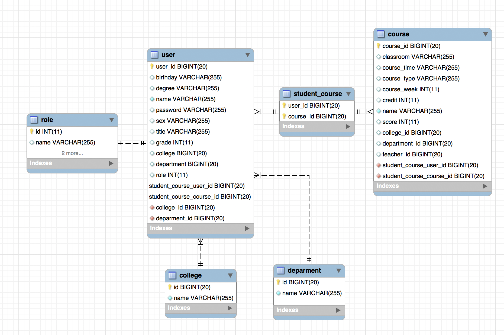
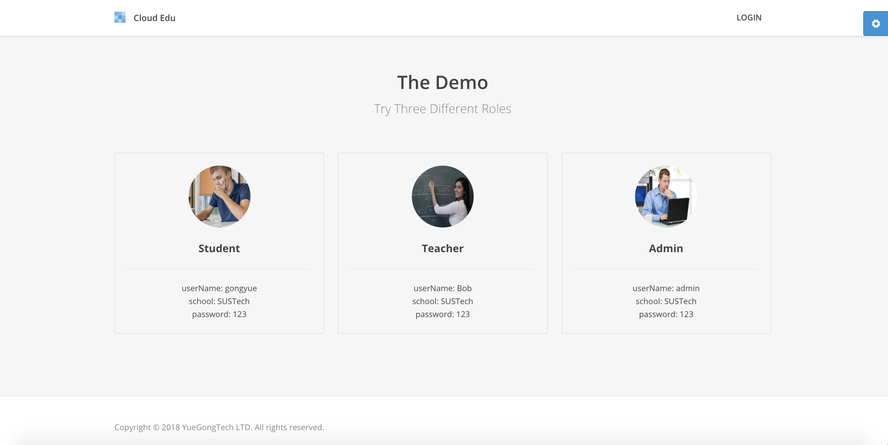
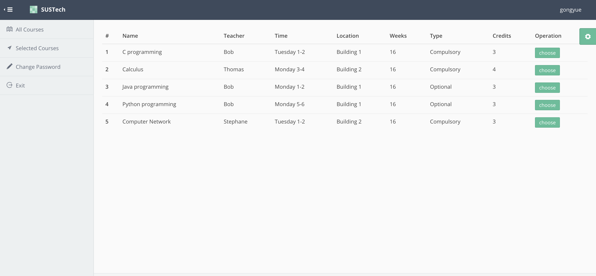
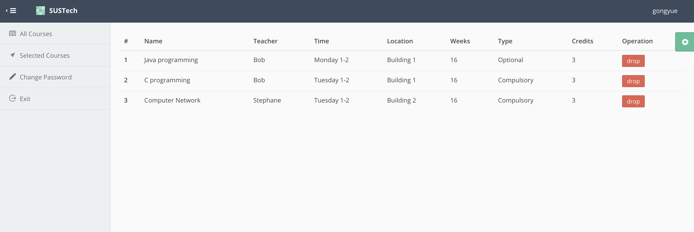
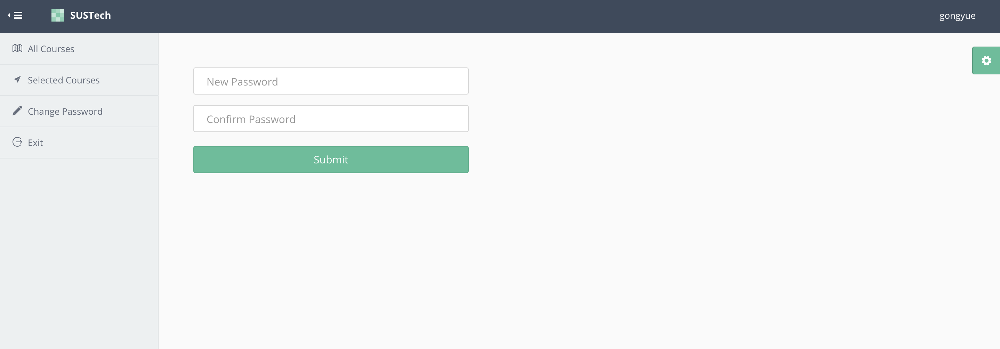
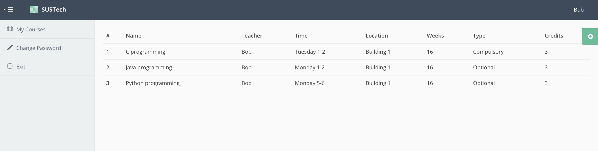
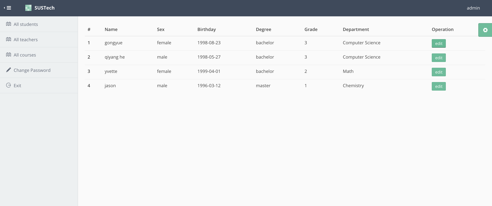
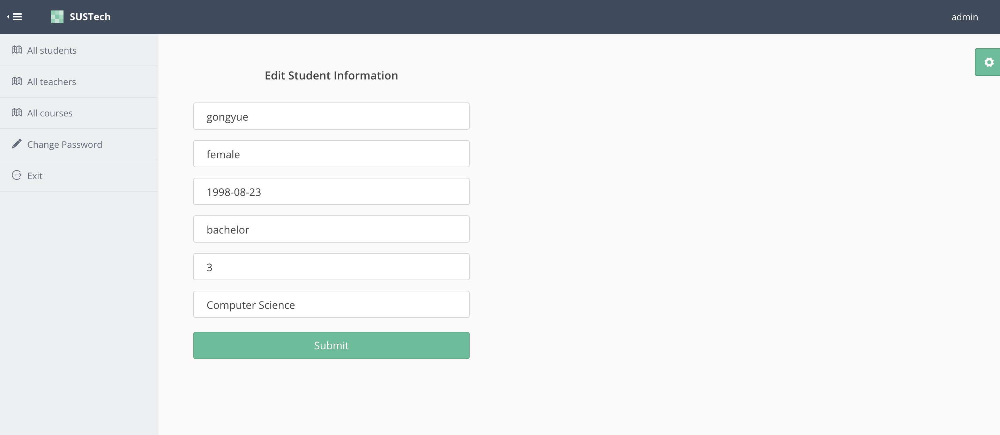

# Cloud Educational Administration System

[](https://github.com/snowgy) 


`Access my demo at 10.20.35.198:8081 (SUSTech School network only)`

## FEATURE

* **Privilege Management**: Provide three different roles: student, teacher, admin.
* **Student/Teacher/Course Information Management**: Admin could modify the information of student/teacher/course. Student and teacher could change their password.
* **Students Elective Management**: Student can select and drop course.

## DESIGN

### SaaS Design

My cloud educational administration system is a well-designed software service. Every school can use the service of my web app easily. I use a seperate table `college` in the database to record the information of each school. Each course or user in my database will associate with their own college. Therefore, user information and course information are well separated in the logic layer. Users from different schools cannot access each other's data. 

If a user want to use this cloud system, I will firstly add his college into the `college` table and inject the college teacher, student and course information into the database. Then they can easily use our system.

### Database Design



The database design is relatively easy. We have six tables in total. They are `user`, `role`, `college`,`department`, `student_course` and `course`. One thing that need to mention is that we conbine student, teacher and admin into one simple object `user` and use the attribute **role** to distinguish them. In addition, teacher will have the attribute **grade** left blank and student will have the attribute **title** left blank.

### Web App Design

My design for the app follows the MVC model. The `dao` layer is for database operation. The `model` layer is the data model used for `ORM ` (object relational mapping). The `sevice` layer contains the business logic. The `web` layer provided object for the front end.

### Technique Stack

`front end`  thymeleaf

`back end` springboot

`orm` hibernate

`privilege management`  shiro

## PROBLEMS

1. Shiro is a powerful and easy-to-use Java security framework that performs authentication, authorization, cryptography, and session management. I met some problems when I was learning how to use it. At first, I cannot tell the difference from `doGetAuthorizationInfo` and `doGetAuthenticationInfo`. And I cannot run shiro properly because I forgot to write a shiroConfig class.

2. I use` thymeleaf` to build my front end. However, I don't know how to call a backend api directly by `button` element through thymeleaf. The traditional way is to write javascript in the onclick attribute. But I really don't want to write the onerous javascript. Finally I found a perfect way to call backend api through thymeleaf which is quite simple using form like the following.

   ```html
   <form action="#" th:action="@{'/dropCourse/'+${user.name}+'/'+${course.id}+'/'+${user.college.name}}" th:method="get" >
      <button type="submit" class="btn btn-danger btn-sm">drop</button>
   </form>
   ```

## RUNNING RESULT

`You can try three different roles by our provided user information.`



### Student

Student could view all the courses.



Select course and drop course



Edit their own password



### Teacher

Teacher can view all the courses they taught



Change their own password


### Admin

admin can see information of all the teachers, students and courses.



admin can also edit the information



